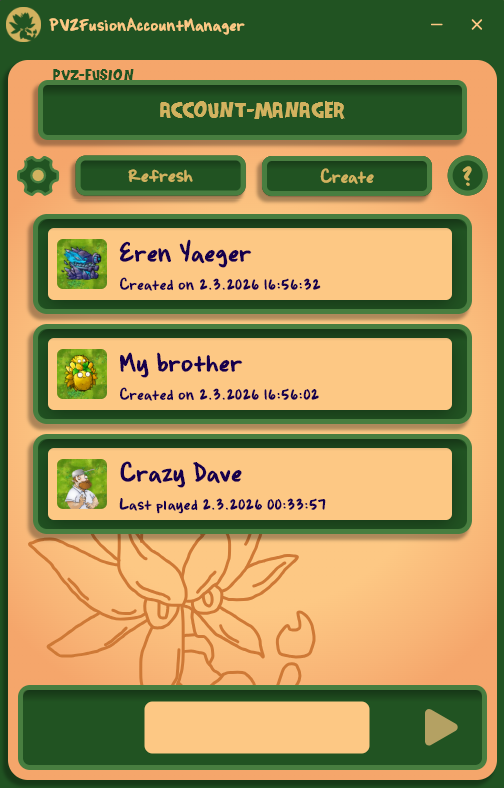
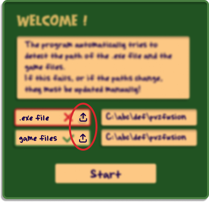
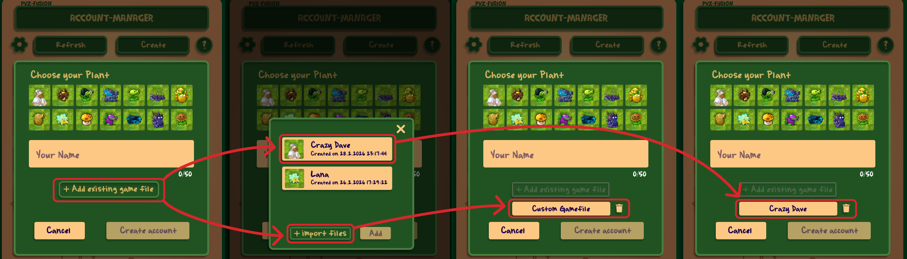
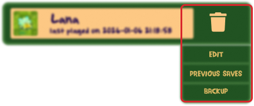
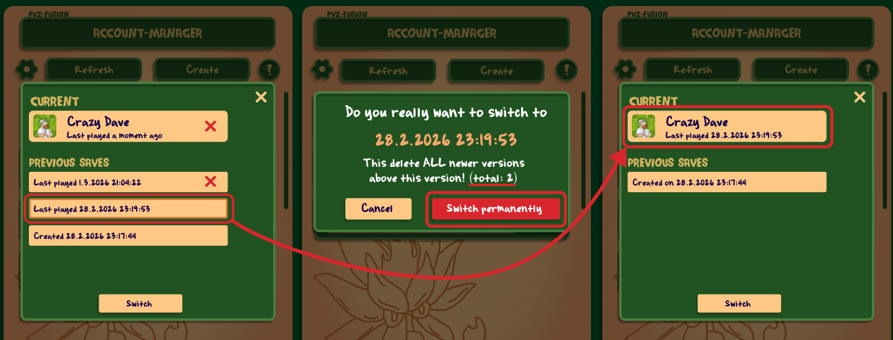
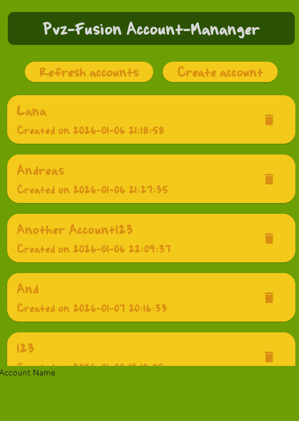
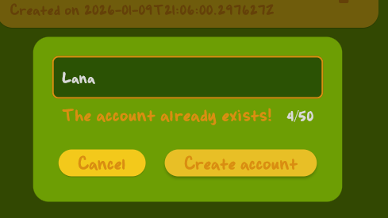
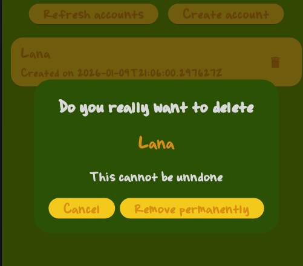

# PvzFusionAccountManager

## Overview

**PvzFusionAccountManager** is an account manager for the fan game *PVZFusion* by LanPiaoPiao.

- Create and manage multiple accounts with independent versioning.
- Select which account to play with.
- Acts as the main entry point for the game, allowing you to start and close it directly.

---

## Motivation

On my birthday, a friend of mine wanted to play a round of *PvzFusion* using my girlfriend’s account and mine.  
We also wanted to watch him play without letting him affect our progress.

So, we thought: *wouldn’t it be nice to have an account manager for this game?*  
We searched online but found no existing solutions.

Thus, **PvzFusion Account Manager** was born.

We quickly began development and sketched the first ideas.

This repo contains the final product and the installer for the manager.

> As it started as a hobby project, feel free to contribute!

We hope this tool will solve not only our problem but also every PvzFusion fan’s problem.

---

## Installation

The application is currently only available for Windows.

The installer for Windows can be found here: [installer](https://github.com/Lukbes1/PvzFusionAccountManager/releases/tag/v1.0.3)

### Installer Warning

The installer may warn that the author is not a trusted publisher.

> This is the same issue *PvzFusion* faces. Registering apps with trusted signatures costs a lot of money and is not worth it for this project.  
> The warning does **not** affect functionality.

---

## Getting Started

### On App Startup

The app automatically searches for:

1. Your downloaded `PlantsVsZombiesFusionRH.exe`
2. The directory where your game saves are stored

If either is not found, a dialog will appear prompting you to provide the paths manually:

 

> The `game files` directory usually doesn’t change, but if it does, you can update it in the previous dialog.  
> This dialog can also be opened later via the **settings** icon.

---

### Playing the Game

By default, a new account is created. 

To play:

1. Select the account.
2. Click the **Play** button:

To quit:

- Press **Quit** in-game, or
- Click the **Stop** button in the account manager:

> The game is automatically saved when quitting via either method.

---

### Quick Guide

    Click the
    
    button to view a simple guide for getting started.

---

## Features and Handling

### General Usage

Once you start using the manager, you are **never forced to stay with the manager and can opt out at any moment**.  
Accounts can always be backed up manually via the **Backup** button (see [Edit Account](#edit-account)).

---

### Refresh

The **Refresh** button:

- Reloads all accounts
- Verifies that your `.exe` and game files directory exist and are intact

---

### Create New Account

Press the **Create** button. A dialog will appear asking for:

- Desired profile picture
- Account name (must be unique)
- Whether to copy from an existing source

You can:

- **Import files** from a directory, or
- **Copy the last saved state** from an existing account

> If copying from an account, a new symbol will appear with the name of the copied account and a **trashcan** icon.  
> Clicking the trashcan removes the copy, allowing you to select a new source.  
> The same happens for imported files, labeled as `Custom gamefile`.

---

### Edit Account

Right-click on an account to open the options dialog:

| Option | Description                                                                                            |
|--------|--------------------------------------------------------------------------------------------------------|
| Trashcan | Permanently delete the account                                                                         |
| Edit | Change the account’s name or profile picture                                                           |
| Previous Saves | Switch to a previous version (last 5 sessions saved). **Note:** newer versions are permanently deleted |
| Backup | Save the last playing state of the account to a directory on your PC  (This ensures you can always manually save your progress if you prefer not to rely solely on the app.)                                |

---

### Changing the Selected `.exe` or Game Files Location

Press the **Settings** button to open the welcome dialog.

Here you can manually change:

- The `.exe` path
- The game files directory

  It is recommended <strong>not to change the game files directory</strong> if it is detected correctly. 
  If not, the default path for PvzFusion is (as of version 3.4):
<code>Users\YourUser\AppData\LocalLow\LanPiaoPiao\PlantsVsZombiesRH</code>

**See** [Getting started](#getting-started)

---

## Common Problems and How To`s

### How to NOT lose your (original) account

The account manager internally uses the same **game files directory** where *PVZFusion* stores your save files after closing the game or making new progress.

The app may add, delete, or move data from and to this directory when switching accounts or versions.

If you do not fully trust the manager, you have the following options to take precautions:

- Whenever you feel unsure about the state of the app, press [Backup](#edit-account) and save your files to a safe location.  
  This backup can:
    - Be manually placed back into the game files directory (as of 02.03.2026):  
      `Users\YourUser\AppData\LocalLow\LanPiaoPiao\PlantsVsZombiesRH`
    - Be used to create a new account via [Create new account](#create-new-account) → add existing game files → import files.

- If the app behaves unexpectedly or does not work at all, uninstall it and choose **`NO`** when asked whether your accounts should be deleted.  
  Then reinstall the app.  
  Your accounts will remain intact as long as you do not confirm deletion during uninstallation.

- **If none of the above works** (requires some technical knowledge):  
  Navigate to  
  `%AppData%\local\lukbessolutions\pvz_fusion_acc_manager\`

  Inside, you will find a `.db` file containing all your accounts.  
  This file is an **SQLite database**.

  Using any SQLite database browser, open the database and locate the table containing your account data.  
  All stored save files are located inside this `.db` file and can be extracted manually if necessary.

### Moving away from this manager

If you want to permanently stop using this manager, follow these steps carefully:

1. For safety, create a backup by pressing [Backup](#edit-account) on the account you want to keep and store it somewhere safe.
2. Start the game via the account manager using the version you want to preserve.
3. Uninstall the manager and confirm all deletions.
4. Start the game normally (without the manager), as you did before installing this application.

    - If your account loads correctly → you are done.
    - If no account appears → continue to step 5.

5. Take the backup files created in Step 1 and paste them into the game files directory (as of 02.03.2026):  
   `Users\YourUser\AppData\LocalLow\LanPiaoPiao\PlantsVsZombiesRH`
6. Start the game again, your files should be loaded correctly. If not, make sure ALL files from the backup are in the pasted directory.
### Switching Versions

If you’ve played multiple sessions and want to revert to an older version:

- Versions newer than the one you select will be deleted.
- Confirm deletion to restore the account to the desired state.

> Example: Selecting version 3 out of 4 will delete versions 1 and 2, where 1 is newest and 4 is oldest.  
> The versions that will be deleted are marked with **a red x** in the example picture (**NOT in the actual application**)  
> Your account will reflect the state as of the selected session timestamp.

---

## License and Copyright

[License](license.txt)

## Concept Art and early sketches

Here is how the manager would have looked, if my girlfriend hadn't been there:

    
    
    

## Last words

**Credits**: Lukas Beschorner did the coding and Lana Langen did the art and design

